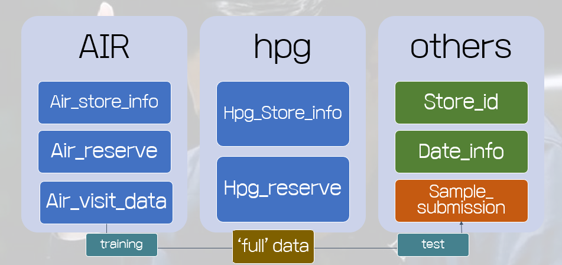
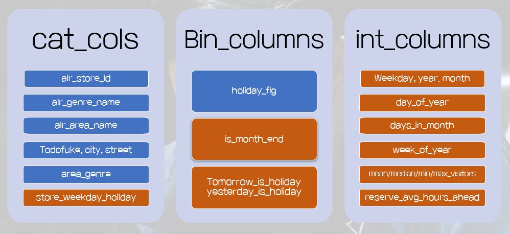
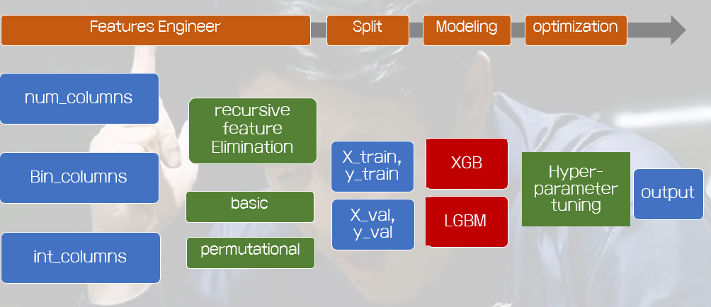

# Kaggle aiffel Hackatone

## 레스토랑 방문자 수 예측 대회  
**팀원 : 김경준, 차수연, 류제성**  
- 김경준 : *[data preprocessing](https://github.com/crosstar1228/Aiffel_Kaggle/blob/master/1.Data_%EC%B5%9C%EC%A2%85.ipynb), [model selection](https://github.com/crosstar1228/Aiffel_Kaggle/blob/master/3.XGBoost_%EC%B5%9C%EC%A2%85.ipynb)*
- 차수연 : *[feature engineering, Data Visualization and EDA](https://github.com/crosstar1228/Aiffel_Kaggle/blob/master/2.Feature_Engineering_%EC%B5%9C%EC%A2%85.ipynb)*
- 류제성 : *[Model Selection](https://github.com/crosstar1228/Aiffel_Kaggle/blob/master/3.XGBoost_%EC%B5%9C%EC%A2%85.ipynb), Presentation*

개요 : **주어진 time series data를 이용하여 방문자 수**를 예측하는 데이터분석 및 머신러닝 대회 참여 ([kaggle website link](https://www.kaggle.com/c/recruit-restaurant-visitor-forecasting))  
Loss funtion : RMSLE  
Ideation :
1) Data를 잘 merge하고,
2) feature engineering을 적절히 하고, 
3) 검증된 모델을 통해 hyperparameter를 조정하면
모델이 좋은 성능을 낼 수 있을 것이다.

Data Structure:  

1) air, hpg 두 지점의 가게와 예약정보
2) 이외에 레스토랑의 지점 id 와 날짜정보 등으로 이루어져 있음

Type of features :  

- 예측 정확도 개선을 위해 기존에 feature로부터 새로운 feature들을 생성

Modelling :  

- XGBoost 모델이 가장 최적화된 성능을 보여주는 것을 확인

